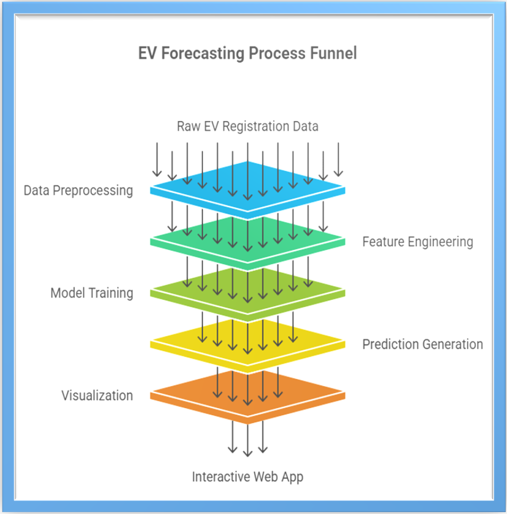
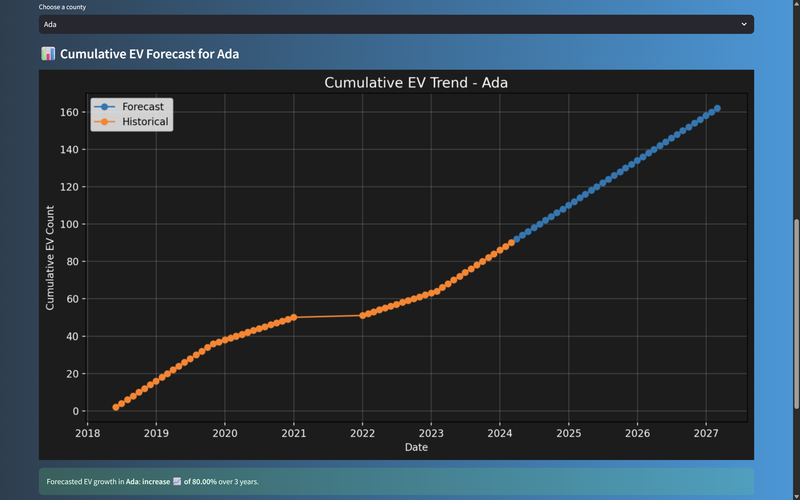
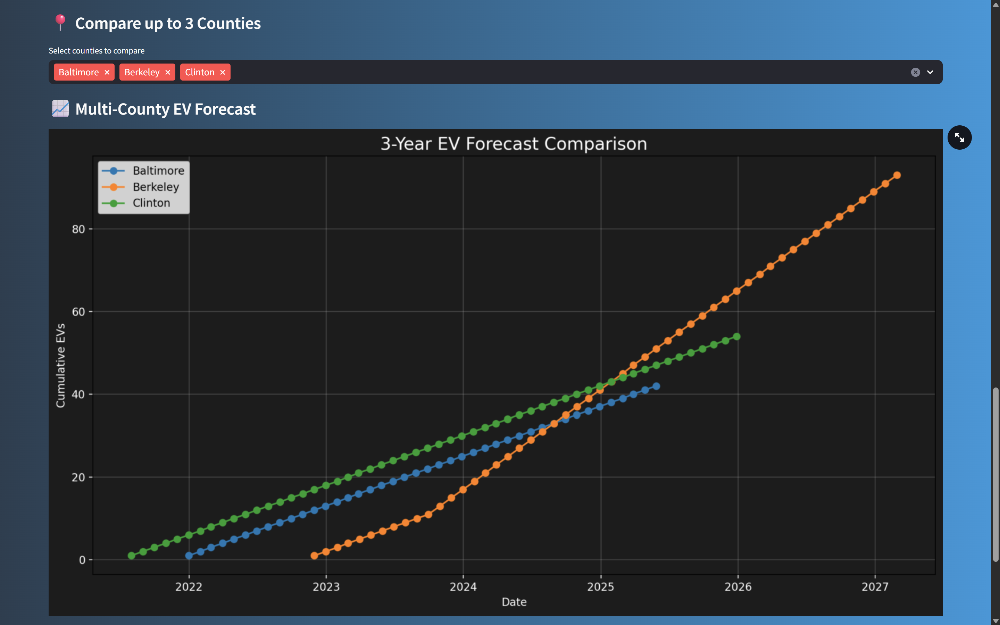

# <picture>  <source srcset="https://fonts.gstatic.com/s/e/notoemoji/latest/1f697/512.webp" type="image/webp">  </picture> EV Adoption Forecast Tool (Streamlit + ML Model)
 
Forecast the growth of Electric Vehicles over a 3-year horizon using historical data, machine learning, and an interactive Streamlit dashboard.

**Project Summary**: This project builds a predictive model to estimate electric vehicle (EV) adoption trends at the county level across Washington state. The core engine is a time series forecasting model trained on real, structured EV registration data. It captures local patterns and extrapolates them 3 years into the future. The results are delivered through an intuitive web app with dynamic visualizations, multi-county comparison, and real-time insights.

----

## <picture><source srcset="https://fonts.gstatic.com/s/e/notoemoji/latest/1f47e/512.webp" type="image/webp"></picture> Live Deployment

Try the app directly on Hugging Face Spaces: 

---

## <picture>  <source srcset="https://fonts.gstatic.com/s/e/notoemoji/latest/1f680/512.webp" type="image/webp"></picture> Core Features

- **County-Level Forecasting** – Predict cumulative EV growth for individual Washington counties.
- **3-Year Forecast Horizon** – Uses last 6 months of trends to project the next 36 months.
- **Machine Learning Powered** – Trained using time-based lag features, percentage changes, and slope indicators.
- **Custom Streamlit UI** – Modern, gradient-themed interface with branded styling and iconography.
- **Multi-County Comparison** – Compare EV adoption forecasts side-by-side across 3 counties.
- **Dynamic Visualization** – Matplotlib plots render cumulative growth curves in real-time.
- **Deployment-Ready** – Fully containerized with Dockerfile and auto-deploy support via Hugging Face.

---
## <picture>  <source srcset="https://fonts.gstatic.com/s/e/notoemoji/latest/1f43e/512.webp" type="image/webp">  </picture> Architecture
 <!-- Replace with your image path or URL -->

---
<!-- ## <picture><source srcset="https://fonts.gstatic.com/s/e/notoemoji/latest/1f916/512.webp" type="image/webp"></picture> **ML & Data Strategy** -->

## <picture><source srcset="https://fonts.gstatic.com/s/e/notoemoji/latest/2699_fe0f/512.webp" type="image/webp"></picture> **Tech Stack**

| Tool | Purpose |
|------|---------|
| **Python 3.10** | Core language |
| **Pandas & NumPy** | Data preprocessing & manipulation |
| **Scikit-learn & Joblib** | Model training & serialization |
| **Matplotlib** | Plotting visualizations |
| **Streamlit** | Building the frontend dashboard |
| **Hugging Face Spaces** | Public deployment |
| **Docker** | Containerization (via Streamlit template) |

---

## <picture>  <source srcset="https://fonts.gstatic.com/s/e/notoemoji/latest/1f4f8/512.webp" type="image/webp">  </picture> Screenshots

### EV Forecast by County  

### Multi-County Trend Comparison  

---

## <picture> <source srcset="https://github.com/Salaar-Saaiem/EV-Adoption-Forecasting/blob/80c12028daea3e17fb2eae40f75e8878f56803aa/Assets/512.webp?raw=true"></picture> Why This Project Stands Out

- Real-world application aligned with EV policy and sustainability.
- Uses thoughtful feature engineering, not just raw time series.
- Interactive, beautiful UI for both technical and non-technical users.
- Packaged for deployment — runs anywhere with zero setup.
- Demonstrates full-stack ML workflow: data → model → UI → deployment.

---

## <picture>  <source srcset="https://fonts.gstatic.com/s/e/notoemoji/latest/1fac6/512.webp" type="image/webp">  </picture> Ownership & License

This project is the intellectual property of [Saaiem Salaar](https://www.linkedin.com/in/salaarsaaiem525) and is licensed under the [MIT License](LICENSE). This means you are free to use, copy, modify, merge, publish, distribute, sublicense, and/or sell copies of the software for personal or commercial purposes, provided that proper credit is given and the original license and copyright notice are included in all copies or substantial portions of the software. The software is provided "as is", without any warranty of any kind, express or implied, and the author is not liable for any claims, damages, or other liabilities arising from its use.

